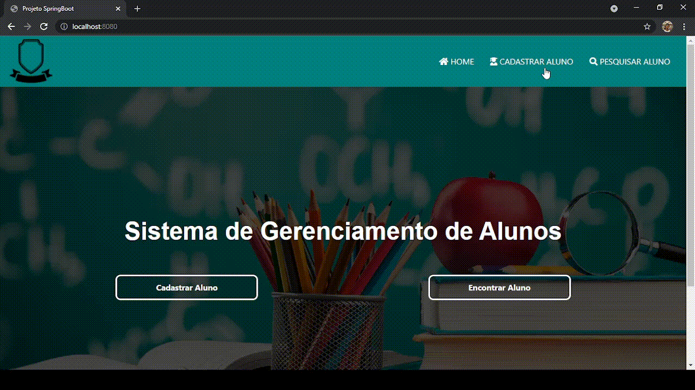
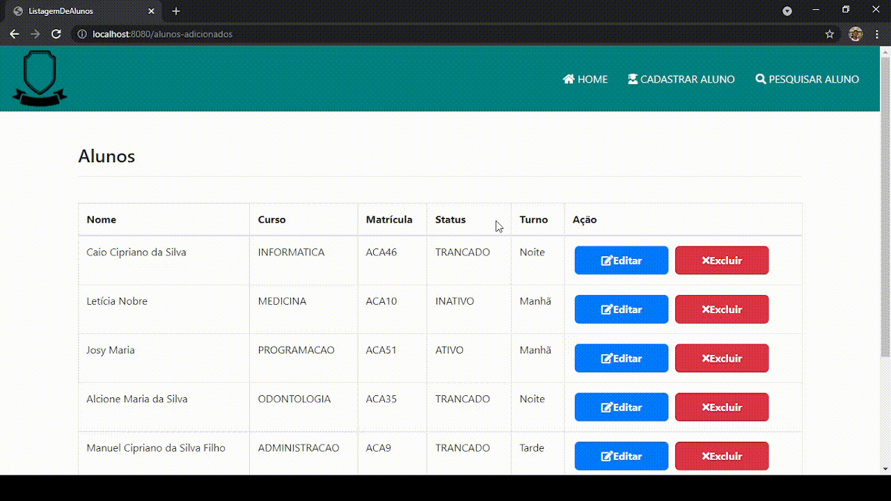

# Gerenciamento de Alunos
Este projeto teve como base, por em prática os estudos e ter como portifólio pessoal!

Linkedln:www.linkedin.com/in/caio-cipriano
<h2>Sobre:</h2>

Através do SpringBoot e outras dependências, nesta aplicação tem como objetivo, gerenciar a matricula e dados dos alunos. Inserir, remover e atualizar são funcionalidades. Utilizei o MySQL como meu banco de dados!

 

<h3>Cadastro de Alunos:</h3>

Dentro do formulário existe o botão Gerar Matricula que é um script do JavaScript que utiliza a Math Random

 

 <h3>Excluindo do Sistema:</h3>

 

 <h3>Atualizando dados cadastrais:</h3>

 

 <h3>Filtro de alunos:</h3>
 
Aqui, é feito um query do JPQL dentro da interface Java, filtrando pelo Status da matrícula

 

 <h3>Botões na aplicação:</h3>
 
Botões e para onde redirecionam

 

